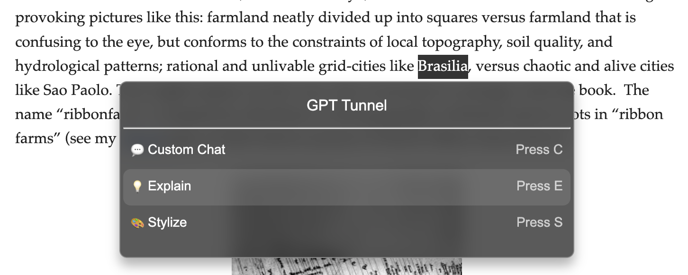

# gpt-tunnel

The main goal of this chrome extension is to lower the "activation energy" for a reader on the web to get questions answered by a chatbot. The extension presents several common actions like explaining the selected text or summarizing the key points. It carries out an action by opening a new window, navigating to chatgpt.com, and automatically sending a message -- "tunneling" from the webpage you're reading on to the webpage where your chat is. So it's free for existing ChatGPT users.

## Use:

Press `Command + Shift + X` to open command pallette.
If you select text to focus on, then the available actions are:

- Custom Chat (Press C)
- Explain (Press E)
- Stylize (Press S)

If you do not select text to focus on, then the available actions are:

- Custom Chat (Press C)
- Key Points (Press K)

A broader goal is to create an entrypoint to a chatting webpage from separate webpages, by exposing the most common, simple prompting patterns.

## Developer Setup

`npm install` to install relevant dependencies
`npm run build` to build the chrome extension
"Load unpacked" at chrome://extensions
Command + Shift + X should trigger the pallette to popup on any webpage

## Next Steps:

- PDF Support (TODO)
- Allow users to create their own actions? They could just specify a template and whether to allow input after selecting the custom action.
